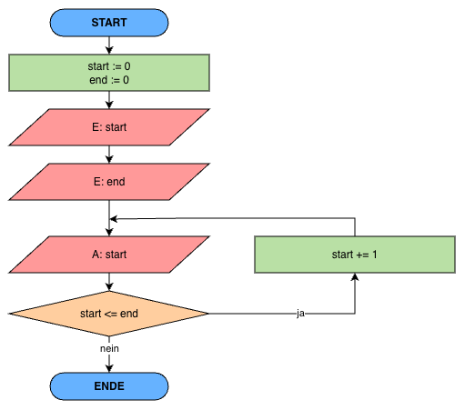

# B1 - Visuelle Darstellung und Modellierung

## Informationen zu diesem Arbeitspaket

- **Richtzeit**: 2 Lektionen
- **Arbeitsform**: Einzel- oder Partnerarbeit
- **Kompetenzen**: [Link zur Kompetenzmatrix](../kompetenzmatrix.md){ target="_blank" }

---

## Thema

### 1. Programmablaufpläne (PAP) einfach erklärt.

Schau dir dieses [YouTube-Video](https://www.youtube.com/watch?v=rmfKfw20bYQ){ target="_blank" } an und notiere dir die wichtigsten Informationen zum Thema.

Beantworte mit dem Video und KI für dich folgende Fragen:

- Was ist ein **Programmablaufplan (PAP)**?
- Für was ist ein PAP in der Praxis **nützlich**?
- Welche **Symbole** musst du kennen?
- Welche **Operatorenarten** kennst du? (Wiederholung aus dem Coding-Unterricht)

Tausche mit deinem **Lernpartner** deine Gedanken aus.

---

### 2. Bezahlvorgang mit Twint

Du möchtest einer Kollegin CHF 25.- via Twint zukommen lassen, da er Tickets für eine Party im Treibhaus Luzern besorgt hat.

Erstelle ein PAP, der Schritt für Schritt zeigt, was du tun musst, um eine Überweisung auszuführen.

Beachte, dass du zuerst die Twint-App startest und mit Gesichtserkennung oder Eingabe des Codes entsperren musst. Dann kannst du die Überweisung tätigen. Solltest du nicht genügend Geld auf dem Konto haben, erscheint eine entsprechende Meldung.

**Tools zur Visualisierung:**

- [Draw.io](https://app.diagrams.net/){ target="_blank" }
- [Visual Paradigm](https://online.visual-paradigm.com/app/diagrams/#diagram:proj=0&type=Flowchart&width=11&height=8.5&unit=inch){ target="_blank" }
- [Miro Board](https://miro.com/de/){ target="_blank" }

---

### 3. Von PAP zu Code

Setze den folgenden PAP in Programmcode um:

**Anweisungen**:

- Nutze eine Programmiersprache deiner Wahl
- Nutze einen Code-Editor deiner Wahl (z.B. VS Code)
- Verzichte auf die Hilfe von KI, damit der Lerneffekt hoch ist

---

### 4. Fibonacci

Die Fibonacci-Folge trifft man in der Physik, Biologie und Astronomie oft an. Man benutzt sie z.B., um eine Kaninchenpopulation (Anzahl Kaninchenpaare in jedem Monat) vorauszusagen. Mit der Fibonacci Folge kann man auch die Fibonacci-Spirale herleiten, die z.B. der Form von Muscheln, Schneckenhäuser, etc. entspricht.

Die Fibonacci-Folge steht in einem unmittelbaren Zusammenhang zum Goldenen Schnitt, der in der Fotografie und Kunst angewendet wird.

Schau dir dieses [YouTube-Video](https://www.youtube.com/watch?v=fLuVeooxBqw){ target="_blank" } zur näheren Erklärung an.

Nun hast du die Aufgabe ein Programm zu erstellen, das den Benutzer auffordert eine "Endzahl" einzugeben (z.B. 60). Dein Programm soll danach die Fibonacci-Folge bis zur Endzahl ausgeben. Erstelle einen **Programmablaufplan (PAP)** und setze diesen in **Code** um.

---

### 5. Lernkontrolle

Alles verstanden? Dann geht es hier zur [Lernkontrolle](https://exam.net/student?code=bNJ6cW){ target="_blank" }.
