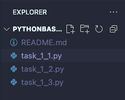

# 🐍 PythonBasics-Repo einrichten

Damit wir alle Aufgaben des Python-Grundlagen-Kurses an einem Ort speichern können, erstellen wir ein **GitHub-Repository**.

1. Gehe auf deiner Maschine zu einem Verzeichnis deiner Wahl und erstelle einen **Ordner** `PythonBasics`
2. Öffne den Ordner in **VS Code**
3. Erstelle für die Aufgaben jeweils ein **Python-File** nach dem Schema: `task_{block_nr}_{aufgaben_nr}.py`
4. Für **Block 1 Aufgabe 1** erstelle also ein Python-File `task_1_1.py`
5. Lege in deinem GitHub-Account ein neues Repository an:
    - Name: **PythonBasics**
    - Visibility: **public**
6. Öffne in VS Code das **Terminal** und **verbinde dein Repository** mit deinem lokalen Ordner.

