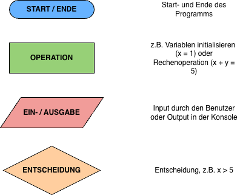

# Variablen & Datentypen (1/2)

## Lernziel
Am Ende dieser Lektion weisst du: was eine Variable ist und wie du ihr einen Wert zuweist, welche Regeln für Variablennamen gelten, welche Datentypen es gibt und wie du sie mit `type()` bestimmst, warum `input()` immer einen String liefert, wie du die wichtigsten String-Operationen anwendest, und wie ein einfacher Programmablauf als PAP aussieht.

## 1. Einstieg
*Warum ist das wichtig?*

- Ohne Variablen kann ein Programm sich nichts merken – weder deinen Namen, noch einen Punktestand, noch das Ergebnis einer Berechnung.
- Jede App, die sich etwas "merkt" (Kontostand, Highscore, Warenkorb), tut dies mit Variablen im Hintergrund.

## 2. Grundlagen
*Um was geht es? Was musst du wissen?*

**Variablen zuweisen**

Eine Variable ist ein benannter Speicherplatz im Arbeitsspeicher (RAM), dessen Inhalt sich ändern kann.

```python
number = 18
```

Du kannst auch mehrere Variablen auf einmal zuweisen:

```python
a, b, c = 5, 3.2, "Hello"
print(a)  # 5
print(b)  # 3.2
print(c)  # Hello
```

**Variablennamen**

Variablen beginnen mit einem Kleinbuchstaben, zusammengesetzte Begriffe werden mit `_` verbunden, keine Sonderzeichen.

| ✅ Erlaubt | ⛔️ Nicht erlaubt |
|---|---|
| number | Number |
| first_name | first-name |
| speed_in_percent | speedin% |

**Datentypen**

In Python musst du den Datentyp nicht selbst festlegen – er wird automatisch erkannt.

| Typ | Kurz | Beispiele |
|---|---|---|
| Zeichenkette | str | "Hallo", "abc123" |
| Ganzzahl | int | -5, 0, 54 |
| Fliesskommazahl | float | -1.25, 7.65 |
| Wahrheitswert | bool | True, False |

```python
name = "Naruto"
type(name)   # <class 'str'>

age = 16
type(age)    # <class 'int'>
```

> 🤓 Bei langen Zahlen wie 1000000 kannst du zur besseren Lesbarkeit `_` verwenden: `1_000_000`. Der Wert ändert sich dadurch nicht.

**PAP (Programmablaufplan)**



Beispiel für "zwei Zahlen einlesen und die Summe ausgeben":


**Konvertieren**

`input()` liefert **immer** eine Zeichenkette (String) – auch wenn eine Zahl eingegeben wird.

```python
age = input("Wie alt bist du? ")
print(type(age))   # <class 'str'>

age = int(input("Wie alt bist du? "))
print(type(age))   # <class 'int'>
```

**String-Operationen**

Zeichen und Indizes: Zählung beginnt bei 0.

```python
text = "HACKER"
text[3]      # K
text[1:4]    # ACK  (Endindex ist nicht mehr enthalten)
```

Weitere nützliche Operationen:

```python
text = "Erste Zeile.\nZweite Zeile."   # \n = Zeilenumbruch

text = "Der \"FCL\" ist mein Lieblingsclub."   # \" für Anführungszeichen im String

text = "Gorilla"
len(text)            # 7 (Länge des Strings)
text.index("r")      # 2 (Position des ersten "r")

print("Hello" + " World" + "!")   # Verkettung mit +

name = "Kim"
print(f"Ich heisse {name}.")      # f-String: Variable in {} einbetten

print(name.upper())   # KIM
print(name.lower())   # kim
```

## 3. Anwendung
*Wie funktioniert es? Schritt für Schritt am Beispiel*

- Schritt 1: Lege eine Variable an: `age = input("Wie alt bist du? ")` und gib mit `print(type(age))` den Datentyp aus – du siehst `<class 'str'>`.
- Schritt 2: Wandle die Eingabe um: `age = int(input("Wie alt bist du? "))` und gib den Datentyp erneut aus – jetzt siehst du `<class 'int'>`.
- Schritt 3: Jetzt kannst du mit `age` rechnen, z.B. `print(age + 1)`.

## 4. Üben
*Aufgaben zum Vertiefen*

### Aufgabe: Erstes eigenes Variablen-Programm
1. Deklariere drei Variablen (eine Ganzzahl, eine Kommazahl, einen Text) und gib jeweils den Datentyp mit `type()` aus.
2. Lies zusätzlich mit `input()` eine Zahl ein, wandle sie mit `int()` um, addiere 10 dazu und gib das Ergebnis aus.
3. Baue mit einem f-String einen Satz, der alle drei Variablen (z.B. Name, Alter, Lieblingszahl) enthält.

## 5. Lösungen

**Beispiel zu 1:**
```python
zahl = 7
kommazahl = 3.5
text = "Hallo"
print(type(zahl))       # <class 'int'>
print(type(kommazahl))  # <class 'float'>
print(type(text))       # <class 'str'>
```

**Beispiel zu 2:**
```python
zahl = int(input("Gib eine Zahl ein: "))
print(zahl + 10)
```

**Beispiel zu 3:**
```python
name = "Kim"
alter = 16
lieblingszahl = 7
print(f"Ich heisse {name}, bin {alter} Jahre alt und meine Lieblingszahl ist {lieblingszahl}.")
```

## 6. Weiterführende Beispiele und Gedanken
*Transfer*

- Achtung, typische Stolperfalle: Wer mit einer über `input()` eingelesenen Zahl direkt rechnet, ohne sie zu konvertieren, bekommt einen Fehler oder ein unerwartetes Ergebnis (Strings werden mit `+` aneinandergehängt statt addiert).
- Nächste Lektion: Ihr vertieft Variablen und Datentypen anhand einer grösseren Sammlung von Übungsaufgaben – Ein-/Ausgabe, Grundrechenarten, Vergleichsoperatoren, logische Operatoren und mehr.
- Überlege: Welche der heute gezeigten String-Operationen (Verkettung, f-Strings, upper/lower) könntest du bereits jetzt in einem eigenen kleinen Programm einsetzen?
