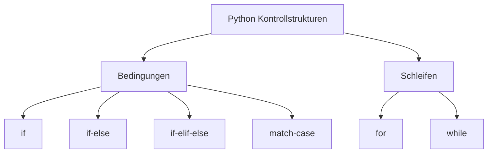

# Kontrollstrukturen 🔀🔁

## Übersicht

In Python steuern **Kontrollstrukturen** den Ablauf eines Programms.
Sie bestimmen, **welcher Code ausgeführt wird**, **wie oft er wiederholt wird** oder **wie auf Fehler reagiert wird**.



---

## Bedingungen 🔀

Mit Bedingungen kann ein Programm **Entscheidungen** treffen.

### if

Die einfachste Form einer Bedingung:

```python
x = 5
if x > 0:
    print("x ist positiv")
```

---

### if-else

Mit else kann ein alternativer Zweig ausgeführt werden:

```python
x = -3
if x > 0:
    print("x ist positiv")
else:
    print("x ist nicht positiv")
```

---

### if-elif-else

Mit elif lassen sich mehrere Bedingungen hintereinander prüfen:

```python
x = 0
if x > 0:
    print("x ist positiv")
elif x == 0:
    print("x ist null")
else:
    print("x ist negativ")
```

---

### match-case (ab Python 3.10)

Das match-Statement ist vergleichbar mit switch in anderen Sprachen, aber deutlich mächtiger (Pattern Matching).

```python
farbe = "rot"
match farbe:
    case "rot":
        print("Stopp")
    case "grün":
        print("Los")
    case _:
        print("Unbekannt")

```

➡️ case _ entspricht dem default-Fall aus anderen Sprachen.

---

## Schleifen (Wiederholungen) 🔁

Schleifen wiederholen Anweisungen, solange eine Bedingung erfüllt ist oder über eine Sequenz iteriert wird.

### for-Loop

Die `for`-Schleife durchläuft Sequenzen oder Iteratoren:

```python
for buchstabe in "Python":
    print(buchstabe)
```

Mit Zahlenbereich:

```python
for i in range(5):
    print(i)   # gibt 0 bis 4 aus
```

---

### while-Loop

Die `while`-Schleife wiederholt Anweisungen, solange eine Bedingung wahr ist:

```python
i = 0
while i < 5:
    print(i)
    i += 1
```

---

## Schleifensteuerung

- `break` – beendet die Schleife sofort
- `continue` – überspringt den aktuellen Durchlauf
- `else` in Schleifen – wird nur ausgeführt, wenn die Schleife nicht durch `break` verlassen wurde

```python
for i in range(5):
    if i == 3:
        break
else:
    print("Schleife ohne break beendet")
```
