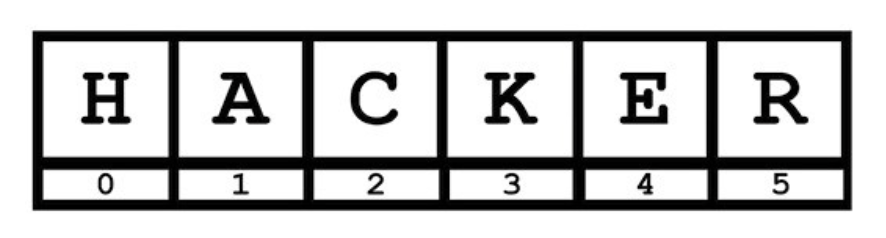

# 🧮 Variablen & Datentypen

## Wert einer Variable zuweisen

Ohne Variablen kommt kein Programm aus. Variablen dienen als **Datenspeicher** und werden während der Ausführung des Programms im Arbeitsspeicher (RAM) abgelegt. Hier ein Beispiel:

```python
number = 18
```

Links steht der Variablenname `number`. Diese Variable speicher den Wert `10`.

Ein zweites Beispiel:

```python
modul_name = "Applikationen entwerfen und implementieren"
```

Hier speichert die Variable `modul_name` den Wert `Applikationen entwerfen und implementieren`.

Ich kann auch **Werte an mehrere Variablen** auf einmal vergeben.

```python
a, b, c = 5, 3.2, "Hello"

print(a) # prints 5
print(b) # prints 3.2
print(c) # prints Hello
```

---

## Variablennamen

Beachte, dass Variablen mit einem **Kleinbuchstaben** beginnen, zusammengesetzte Begriffe mit einem `_` verbunden werden und keine Sonderzeichen enthalten dürfen.

<table>
    <tr>
      <th>✅ Erlaubt</th>
      <th>⛔️ Nicht erlaubt</th>
    </tr>
    <tr>
      <td>number</td>
      <td>Number</td>
    </tr>
    <tr>
      <td>h4acker</td>
      <td>8ung</td>
    </tr>
    <tr>
      <td>first_name</td>
      <td>first-name</td>
    </tr>
    <tr>
      <td>speed_in_percent</td>
      <td>speedin%</td>
    </tr>
</table>

---

## Datentypen

In Python ist es nicht nötig, den Variablen einen **festen Datentyp** zu zuzuweisen. Es wird automatisch erkannt, ob der gespeicherte Wert eine **Zahl** (Integer oder Float), eine **Zeichenkette** (String) oder ein **Wahrheitswert** (Boolean) ist.

Folgende **Datentypen** solltest du kennen:

<table>
    <tr>
      <th>Typ 🇩🇪</th>
      <th>Typ 🇬🇧</th>
      <th>Kurzschreibweise</th>
      <th>Beispiele</th>
    </tr>
    <tr>
      <td>Zeichenkette</td>
      <td>String</td>
      <td>str</td>
      <td>"Hallo", "abc123", "0.62", "Mein Name"</td>
    </tr>
    <tr>
      <td>Ganzzahlen</td>
      <td>Integer</td>
      <td>int</td>
      <td>-5, -3, 0, 8, 54</td>
    </tr>
    <tr>
      <td>Fliesskommazahlen</td>
      <td>Float</td>
      <td>float</td>
      <td>-1.25, -1.0, 0.0, 7.6543</td>
    </tr>
    <tr>
      <td>Wahrheitswerte</td>
      <td>Boolean</td>
      <td>bool</td>
      <td>True, False</td>
    </tr>
</table>

Um den Datentyp einer Variable herauszufinden, kannst du die **Funktion** `type` verwenden.

```python
name = "Naruto"
type(name) # <class 'str', also String

age = 16
type(age) # <class 'int', also Integer

hero = True
type(hero) # <class 'bool', also Boolean
```

> 🤓 Um lange Ganzzahlen wie z.B. 1000000 besser lesen zu können, kann man `_` verwenden. Z.B. 1_000_000. Der Wert ändert sich dadurch nicht.

---

## Konvertieren - Benutzereingabe mit input()

Es ist wichtig zu wissen, dass der **input()-Befehl** immer einen *Zeichenkette* (String) einliest. Selbst wenn die Eingabe eine *Ganzzahl* (Integer), z.B. 16, ist.

```python
# using input() to take user input
age = input("Wie alt bist du? [in Jahren]: ")

# print age
print("Dein Alter: ", age)

# investigate data type of age
print ("Datentyp der Variable age: ", type(age))
```

Damit wir mit der Variable *age* rechnen können, müssen wir sie zuerst in einen Zahlentyp wie Integer oder Float **konvertieren (umwandeln)**. Das machen wir mithilfe der **int()-** oder **float()-Funktion**.

```python
age = int(input("Wie alt bist du? [in Jahren]: "))
```

Hier wird der der Datentyp der Benutzereingabe von String zu Integer konvertiert.

---

## String-Operationen

Es gibt verschiedene Möglichkeiten Strings umzuformen, zu verkürzen und oder sie zusammenzusetzen.

### Index einer Zeichenkette

Als erstes ist es aber wichtig, dass wir verstehen, wie eine Zeichenkette aufgebaut ist. Schaue dir dazu die **Position der Buchstaben** im String `HACKER` an.



In der Informatik beginnen wir stets **bei 0** mit zählen. Der String `HACKER`besteht aus 6 Zeichen, wobei das `H` die Position 0 und das `R` die Position 5 hat. Im Englischen verwendet man statt Position den Begriff **Index.**

### Substrings

Einzelne Zeichen oder Substrings kannst du mithilfe eckiger Klammern `[]` und dem Index auslesen.

```python
text = "HACKER"

text[3] # K
```

Du kannst auch mehre Zeichen aus einem String ausschneiden (*slicing*), indem du den *3* und den **Endindex** angibts.

> ⚠️ Achtung: Der Endindex ist nicht mehr im Slice enthalten.

Um `ACK`aus dem String `HACKER`auszuschneiden, gibt man also den Index von `A`und `E`(eins mehr als K) an und setzt einen **Doppelpunkt** dazwischen.

```python
text = "HACKER"

text[1:4] # ACK
```

### Zeilenumbruch

Einen **Zeilumbruch** erzeugst du mit `\n`. Das steht für *new Line*.

```python
text = "Erste Zeile.\nZweite Zeile."

print[text]

# Output:
# Erste Zeile.
# Zweite Zeile.
```

### Anführungszeichen innerhalb eines Strings

Willst du innerhalb eines Strings **Anführungszeichen** nutzen, ohne einen Fehler zu erzeugen, brauchst du das Markierungszeichen `\"`.

```python
text = "Der \"FCL\" ist mein Lieblingsclub."    # Der "FCL" ist mein Lieblingsclub.
```

### Länge eines Strings

Um die Länge eines Strings zu ermitteln, brauchst du die Funktion `len()`.

```python
text = "Gorilla"
len(text)   # 6
```

Um den Index des Buchstabens `r` in Gorilla zu ermitteln, nimmst du die Funktion `.index()`.

```python
text = "Gorilla"
print(text.index("r"))  # 2
```

### Strings zusammensetzen

Um Strings zusammenzusetzen, kann man sie mit `+` addieren.

```python
print("Hello" + " World" + "!")     # Hello World!
```

Man kann auch String-Variablen zusammensetzen.

```python
text1 = "Hello"
text2 = "World!"

print(text1 + " " + text2)     # Hello World!
```

Um Variablen aller Typen in einem String einzubinden, schreibt man ein `f` vor den String und setzt die Variable in geschweifte Klammern `{}`.

```python
name = "Kim"
language = "Python"

print(f"My name is {name} and I am learning {language}.")

# My name is Kim and I am learning Python.
```

### Gross- und Kleinbuchstaben

Um Strings komplett in **Gross- oder Kleinbuchstaben** zu transformieren, stehen die Funktionen `upper()` und `lower()` zur Verfügung.

```python
name = "Ringo"

print(name.upper())     # RINGO
print(name.lower())     # ringo
```

### Weitere String-Funktionen

Weitere String-Funktionen kannst du in der offiziellen Python-Dokumentation nachlesen:

[https://docs.python.org/3/library/string.html](https://docs.python.org/3/library/string.html)

---

## Rechnen

### Grundrechenarten

Die vier mathematischen Grundrechenarten **Addition** (+), **Substraktion** (-), **Multiplikation** (*) und **Division** (/) sind auch in Python möglich.

```python
print(5 + 8)        # 13

print(5 - 3)        # 2

print (3 + 2.0)     # 5.0   Wenn ein Element in einer Rechnung ein Float ist, wird das Ergebnis auch immer ein Float

print(5 * 80)       # 400

print (6 / 2)       # 3.0   Bei / kommt immer ein Float raus

print (6 / 4)       # 1.5

print (6 // 4)      # 1     Das ist die sogenannte Integer-Division, bei der die Nachkommastellen einfach weggelassen werden
```

### Runden

Um Float-Zahlen zu runden, braucht man die Funktion `round(x, y)`. Für **x** setzt man die zu rundende Zahl ein, für **y** die Anzahl Nachkommastellen.

```python
number = 3.5 / 1.2   # 2.916666666666667

round(number, 2)     # 2.91     number wird auf 2 Nachkommastellen gerundet
```

### Inkrementieren und Dekrementieren

Wenn du den Werte einer Variable um 1 erhöhen bzw. verringern möchtest, bezeichnet man das als **Inkrementieren bzw. Dekrementieren**.

```python
number = 18

number += 1     # 19    number wird um den Wert 1 erhöht
number -= 1     # 17    number wird um den Wert 1 verringert
```

Man kann den Wert statt um 1 auch um einen **beliebigen Wert** erhöhen bzw. verringern.

```python
number = 18

number += 2     # 20    number wird um den Wert 2 erhöht
number -= 8     # 10    number wird um den Wert 8 verringert
```

### Potenzieren

Beim Potenzieren wird eine Zahl n-mal mit sich selbst multipliziert.

```python
print(2 ** 5)     # 32  Entspricht 2`5. Hier wird also 2 * 2 * 2 * 2 * 2 gerechnet
```

### Integer-Division und Modulo

Wenn das Ergebnis einer Divison keine Gannzahl ergibt (z.B. 1.5), dann können wir mit der **Integer-Divison** dafür sorgen, dass das Ergebnis eine Ganzzahl ausgibt und die Stellen nach dem Komman wegschneidet (nicht runden).

```python
print (6 / 4)       # 1.5

print (6 // 4)      # 1     Integer-Division. Die Nachkommastelle wird weggelassen
```

Interessieren wir uns bei einer Division für den **Rest**, dann verwenden wir den **Modulo-Operator** `%`.

```python
print (9 % 3)       # 0     9 / 3 = 3, Rest 0

print (9 % 2)       # 1     9 / 2 = 4, Rest 1

print (5 % 9)       # 5     5 / 9 = 0, Rest 5
```

### Vergleichsoperatoren

Mit **Vergleichsoperatoren** könnne wir Werte miteinander vergleichen. Das Ergebnis eines Vergleichs ist ein Wahrheitswert vom Datentyp `bool`, als entweder `True`oder `False`.

<table>
    <tr>
      <th>Operator</th>
      <th>Bedeutung</th>
    </tr>
    <tr>
      <td>a < b</td>
      <td>a kleiner als b</td>
    </tr>
    <tr>
      <td>a <= b</td>
      <td>a kleiner oder gleich b</td>
    </tr>
    <tr>
      <td>a == b</td>
      <td>a gleich b</td>
    </tr>
    <tr>
      <td>a != b</td>
      <td>a ungleich b</td>
    </tr>
    <tr>
      <td>a >= b</td>
      <td>a grösser gleich b</td>
    </tr>
    <tr>
      <td>a > b</td>
      <td>a grösser als b</td>
    </tr>
</table>

Hier ein paar Beispiele:

```python
7.6 > 1             # True, weil 7.6 grösser als 1 ist

34 >= 34            # True, weil 34 grösser oder gleich 34 ist

5 == 7              # False, weil 5 nicht gleich 7 ist

50 != 78            # True, weil 50 ungleich 78 ist

0.5 < 0.3           # False, weil 0.5 nicht kleiner als 0.3 ist
```

Man kann auch **Strings** miteinander vergleichen.

```python
"Password123" == "Password321"  # False, weil die beiden Strings nicht gleich sind

"Juliana" != "Julianna"         # True, weil die beiden Strings ungleich sind
```

### Logische Operatoren

Mit **logischen Operatoren** kann man Wahrheitswerte verknüpfen und vergleichen.

#### AND

Werden zwei Wahrheitswerte a und b mit einem `and`verküpft, dann ist das Ergebnis genau dann `True`, wenn a UND b beide `True` sind. Ist a oder b (oder beide) `FALSE` ist auch die Verknüpfung `FALSE`.

```python
8 > 5 and 4 != 2        # True, da beide Aussagen (8 > 5 und 4 != 2) True sind

8 > 5 and 4 = 2         # False, da eine Aussage (8 > 5) zwar True, aber die andere (4 = 2) False ist

8 < 5 and 4 = 2          # False, da beide Aussagen (8 < 5 und 4 = 2) False sind
```

#### OR

Werden zwei Wahrheitswerte a und b mit einem `or`verküpft, dann ist das Ergebnis `True`, wenn a ODER b (oder beide) `True` sind. Sind beide `FALSE` ist auch die Verknüpfung `FALSE`.

```python
8 > 5 or 4 != 2         # True, da beide Aussagen (8 > 5 und 4 != 2) True sind

8 > 5 or 4 = 2          # True, da mindestens eine Aussage (8 > 5) True ist

8 < 5 or 4 = 2          # False, da beide Aussagen (8 < 5 und 4 = 2) False sind
```

#### XOR

Werden zwei Wahrheitswerte a und b mit einem `^`(xor) verküpft, dann ist das Ergebnis `True`, wenn ENTWEDER a ODER b `True` sind, ABER NICHT BEIDE. Sind beide `FALSE` ist auch die Verknüpfung weiterhin `FALSE`.

```python
8 > 5 ^ 4 = 2          # True, da mindestens ein Element (8 > 5) True ist

8 < 5 ^ 4 = 2          # False, da beide Elemente (8 < 5) und (4 = 2) False sind

8 > 5 ^ 4 != 2         # False, da beide Elemente (8 < 5) und (4 = 2) True sind
```

#### NOT

Beim Operator `NOT` wird ausnahmsweise nur der Wahrheitswert einer Aussage beurteilt. Und zwar wird hier überprüft, ob die Aussage insgesamt `FALSE` ist.

```python
3 == 3                 # True, da 3 gleich 3 ist

"John" == "John"       # True, da die beiden Strings übereinstimmen

not 3 == 3             # False, da 3 gleich 3 ist, aber negiert wird

not "John" == "Pam"    # True, da John ungleich Pam ist, und dies korrekterweise negiert wird
```
